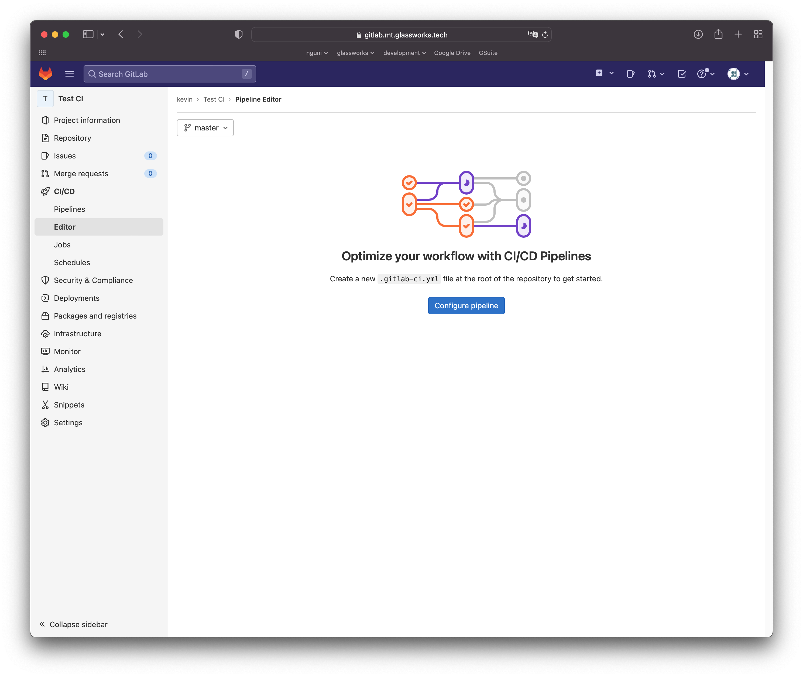
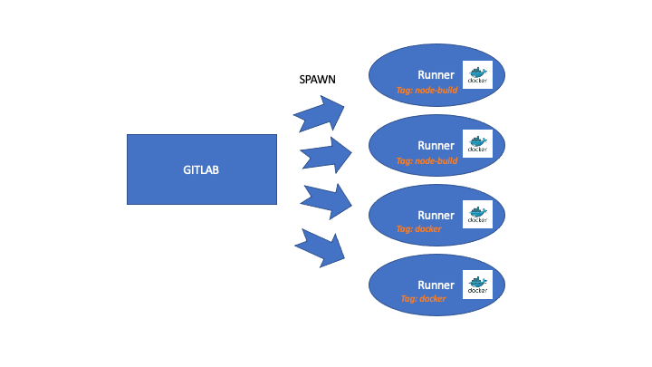
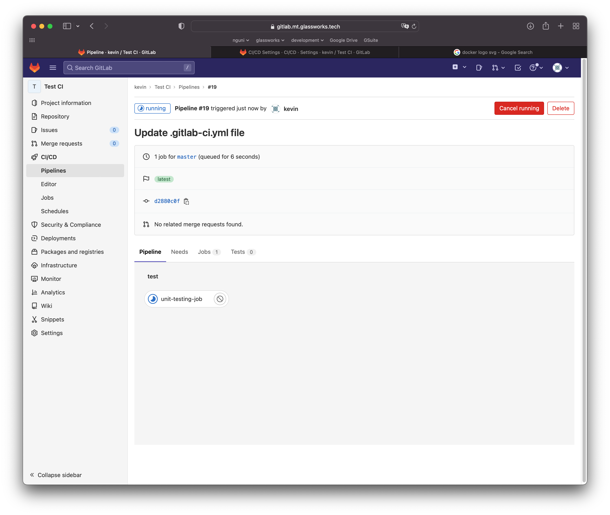
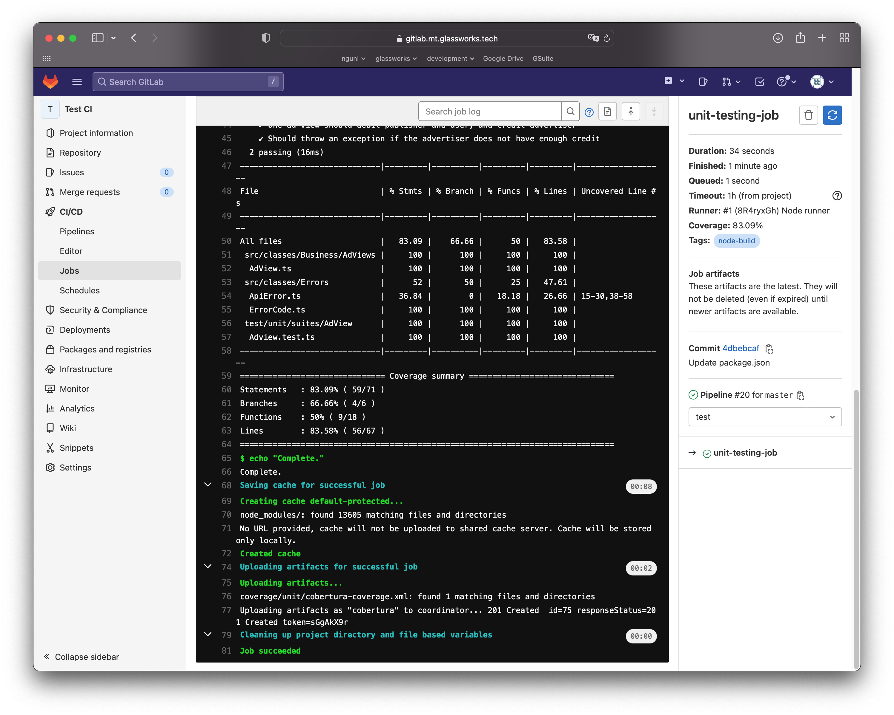
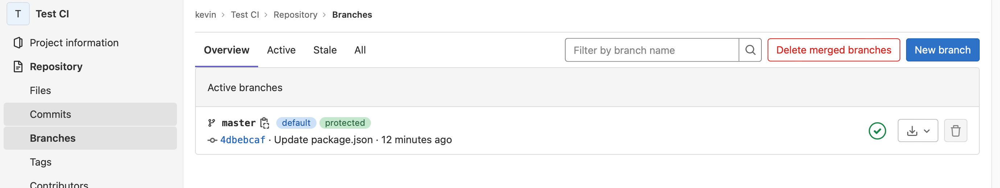
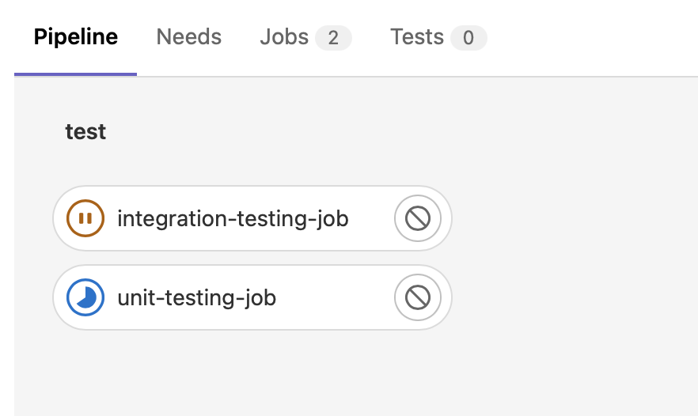
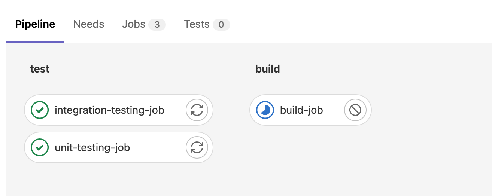
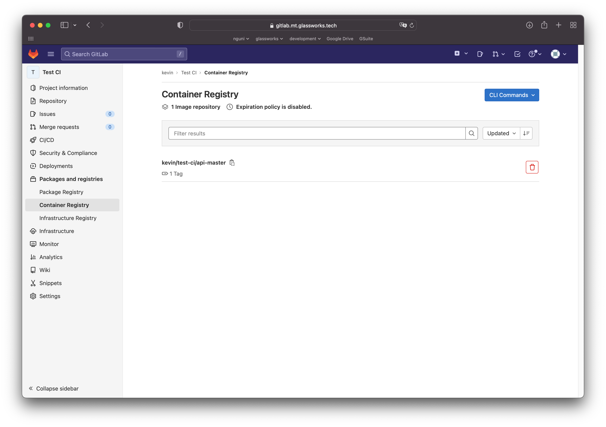
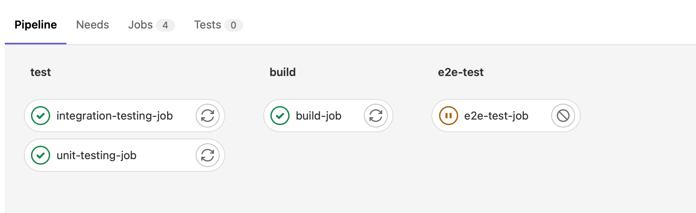

[[_TOC_]]

# Continuous integration

Maintenant qu'on a une banque de tests automatiques, on aimerait les utiliser pour assurer notre procédure de Continuous Integration.

Pour cela, il faudrait une plateforme de développement comme GitHub ou GitLab, qui va permettre l'automatisation des tâches.

Pour ce cours, nous allons utiliser une instance de Gitlab que je mets à votre disposition :

[Gitlab du cours Hetic Master Tech](https://gitlab.mt.glassworks.tech)

Vous pouvez vous créer un compte avec votre adresse `@hetic.eu`. Merci d'utiliser votre vrai nom pour la création du compte pour que je puisse vous identifier plus facilement.

N'oubliez pas à charger votre clé SSH pour plus facilement faire les clones et pull et push.


## Créer votre premier projet

Vous avez besoin de créer une projet afin de profiter de Continuous Intégration de Gitlab.

> Exercice : créez un projet, importer les fichiers de ce projet, branche `004-ci` dedans. Faites le nécessaire pour commit et push.


## .gitlab-ci.yml

Gitlab va automatiquement lancer des processes  d'intégration et/ou déploiement selon les instructions précisées dans le fichier `.gitlab-ci.yml` qui devrait se trouver à la racine de notre projet.

Alternativement, on pourrait naviguer dans le menu CI/CD de gitlab, et dans le sous-menu "Editor", pourrait modifier directement ce fichier.



> Notez que avec chaque sauvegarde, on fait implicitement un commit à notre branche actuelle !


Collons le texte suivant dans l'éditeur :

```yml
# "stages" décrit les différents étapes de notre déroulé (pipeline)
stages:  
  - test

cache:
  paths:
    - node_modules/

unit-testing-job:      
  stage: test        # chaque tâche doit préciser le "stage" dans lequel il se trouve
  image: node:18     # l'image docker à utiliser pour éxecuter notre code    
  tags:              # le tag du "runner" à utiliser
    - node-build
  only:              # précise les conditions d'éxecution de cette tâche
    - master         
    - main
    - merge_requests
    - production
  artifacts:         # quels sont les fichiers sortant de cette tâche
    reports:
      coverage_report:
        coverage_format: cobertura
        path: coverage/unit/cobertura-coverage.xml
  coverage: '/Statements\s*: \d+\.\d+/'
  script:           # les instructions à éxecuter dans le conteneur Docker
    - echo "Compiling the code..."
    - npm install
    - echo "Running unit tests..."
    - npm run unit    
    - echo "Complete."

```

Quand on sauvegarde, Gitlab va lancer un "Runner" (avec le tag `node-build`).

Qu'est-ce que c'est un Runner ? 



Un runner est un processes qui tourne sur un autre serveur ou instance. J'ai manuellement inscrit quelques runners pour ce cours avec des tags `node-build` et `docker` (chacun avec une configuration différente).

Quand le pipeline de Gitlab se lance, un Runner et activé pour chaque tâche. En vrai, un container Docker est crée, dans lequel tourne le script précisé sous `script` dans `.gitlab-ci.yml`.

## Stages

Notre pipeline se compose de plusieurs étapes. Chaque étape doit compléter avant de procéder au suivant. Dans notre fichier, on a crée un seul étape `test`. On a attaché la tâche `unit-testing-job` à cet étape.

## Le tag `only`

Via le tag `only`, on a pu préciser exactement QUAND chaque tâche doit être exécuté. Ici on précise que le pipeline doit exécuter s'il y a un commit sur la branch `master`, `main` ou `production`. Aussi, si un merge-request est crée ou mis à jour.

Cela veut dire que si on crée une branche lambda, le pipeline ne va s'exécuter tant que cette branche ne devient pas un merge request. 

## Artifacts

Un artifact est un fichier sortant de notre tâche qui sera sauvegardé dans git. Ici, on utilise les données sortantes de `istanbul` qui indique le *code coverage* de nos tests. Gitlab comprend ce format, et on pourrait donc voir dans les merge-requests les lignes touchées par les tests ou pas.

## Surveiller l'exécution

On peut voir l'avancement de notre pipeline :



Et pour chaque tâche, consulter le progrès ou les résultats :



Partout dans gitlab, on peut aussi consulter le statut du pipeline :



> Exercice : Est-ce que votre pipeline termine correctement ? Essayer de modifier vos codes sources pour ne plus faire fonctionner vos tests, et faire un commit. Qu'est-ce qui se passe ?

> N'oubliez pas de corriger votre code après !


## Ajouter une étape pour nos tests d'intégration

On va ajouter nos tests d'intégration. 

Par contre, ses tests ont besoin s'un dépendance externe, notamment MariaDB. Comment faire ?

Grâce à Docker, on pourrait préciser MariaDB comme un service externe.

Ajoutez le suivant à votre `.gitlab-ci.yml` :

```yml
integration-testing-job:      
  stage: test       # Cette tâche va tourner dans l'étape test, en parallèle de l'autre test
  image: node:18
  tags:
    - node-build
  only:
    - master     
    - main
    - merge_requests
    - production
  services:        # On peut préciser les services externes, comme dans un docker-compose.yml
    - name: mariadb:10
      alias: test-dbms      
      command: [
        "--character-set-server=utf8mb4",
        "--collation-server=utf8mb4_unicode_ci"
      ]
      variables:  # Les variables pour initialiser MariaDB (normalement les contenus du .env)
        MYSQL_ALLOW_EMPTY_PASSWORD: "false"
        MYSQL_ROOT_PASSWORD: "dbms-dev-password"
        MYSQL_DATABASE: "mtdb_test"     
  variables:      # Les variables d'environnement pour nos tests
    DB_HOST: "test-dbms"                    # Le nom d'hôte est le alias du service ci-dessus
    DB_DATABASE: "mtdb_test"                # Le même nom que dans MYSQL_DATABASE
    DB_ROOT_USER: "root"
    DB_ROOT_PASSWORD: "dbms-dev-password"   # La même valeur que dans MYSQL_ROOT_PASSWORD
    DB_USER: "api-test"                     # La même valeur qu'on utilise dans dbms/test-initdb.d/001-init-test.sql
    DB_PASSWORD: "api-test-password"        # La même valeur qu'on utilise dans dbms/test-initdb.d/001-init-test.sql
  artifacts:
    reports:
      coverage_report:
        coverage_format: cobertura
        path: coverage/integration/cobertura-coverage.xml
  coverage: '/Statements\s*: \d+\.\d+/'
  script:
    - echo "Compiling the code..."
    - npm install
    - echo "Running integrations test..."
    - npm run integration-no-env            # Notez qu'on tourne la version *-no-env, puisqu'on fournit le variables ci-dessus
    - echo "Complete."
```

Quand on push notre modification, on voit qu'il y a 2 tâches dans notre pipeline maintenant :



> Ouvrez le console de la tâche `integration-testing-job`. Vous verrez que MariaDB est chargé et utilisé pour exécuter nos tests !

## Build notre image Docker finale

On est content de nos tests pour le moment. On aimerait maintenant construire uen image Docker qu'on pourrait utiliser pour déployer en production.

Heuresuement, Gitlab-CI pour le faire pour nous !

D'abord, on va ajouter un stage `build` qui va être exécuté seulment si le stage `test` aurait bien terminé.

```yml
stages:  
  - test
  - build
```

Ensuite, on ajoute une nouvelle tâche à notre pipeline :

```yml
build-job:
  stage: build      # seulement dans le "build" stage
  tags:
    - docker        # on va utiliser un Runner dédié à builder les images Docker
  only:
    - master
    - main
    - merge_requests
    - production
  image: docker:20.10.16      # L'image pour construire est docker (qui aura la commande docker dedans)
  services:                   # On va appeler au Docker Daemon, ce service nous en donne accès
    - name: docker:20.10.16-dind
      alias: docker
  variables:                  # On va créer une image docker utilisant des variables fournis par Gitlab
    IMAGE_TAG: $CI_REGISTRY_IMAGE/api-$CI_COMMIT_REF_NAME:$CI_COMMIT_SHORT_SHA
  script:
    # Se connecter à Gitlab
    - docker login -u $CI_REGISTRY_USER -p $CI_REGISTRY_PASSWORD $CI_REGISTRY
    - echo "Building docker image..."
    # Créer l'image docker
    - docker build --pull -t $IMAGE_TAG -f ./Dockerfile.prod .
    # Envoyer l'image docker dans notre Container Registry sur Gitlab
    - docker push $IMAGE_TAG
    - echo "Done."
```

Remarquez une nouveau stage dans notre pipeline :



Vous allez remarquez dans la console que l'image Docker est construit en utilisant le Dockerfile.prod qu'on avait précisé dans le projet. Notamment, on compile et installe les node_modules.

Ensuite, la tâche va envoyer l'image final à notre "Container Registry" personnalisé sur Gitlab.



Le container de registry de Gitlab est comme Docker Hub, sauf qu'on peut gérer les images en interne et en privé !

## e2e test avec notre image de production

Vous avez peut-être remarqué qu'on n'a pas encore intégré nos tests e2e. C'est fait exprès !

En fait, notre objectif est de lancer nos tests e2e contre notre image de production, pour être double sur que l'image docker fonctionne correctement. Nous somme vraiment très proches aux conditions de déploiement !

Cette tâche est un peu plus compliqué à configurer :
* Il faut lancer MariaDB comme avant
* Il faut récupérer notre image qu'on vient de créer, et l'instancier en tant que `service` pour notre tâche (et lui dire de communiquer avec le service MariaDB). 
* Ensuite, on lance notre test e2e, en lui disant d'envoyer ses requêtes à ce service

On commence par ajouter une autre étape `e2e-test`:

```yml
stages:  
  - test
  - build
  - e2e-test   
```

On va ajouter une variable globale, qui dit à gitlab de laisser communiquer les services entre eux (pour que notre API puisse parler avec MariaDB) :

```yml
variables: 
  FF_NETWORK_PER_BUILD: "true" 
```

Ensuite, on ajoute une nouvelle tâche :

```yml

e2e-test-job:
  stage: e2e-test
  tags:
    - node-build  
  only:
    - master
    - main
    - merge_requests
    - production
  services:
    # Notre service MariaDB, configuré comme avant
    - name: mariadb:10        
      alias: test-dbms      
      command: [
        "--character-set-server=utf8mb4",
        "--collation-server=utf8mb4_unicode_ci"
      ]
      variables: 
        MYSQL_ALLOW_EMPTY_PASSWORD: "false"
        MYSQL_ROOT_PASSWORD: "dbms-dev-password"
        MYSQL_DATABASE: "mtdb_test"     
    # On récupère l'image de notre API qu'on avait compilé dans l'étape "build", et on le lance comme service
    - name:  $CI_REGISTRY_IMAGE/api-$CI_COMMIT_REF_NAME:$CI_COMMIT_SHORT_SHA
      alias: mtdb-api     # on l'appelle mtdb-api
      # Ici, le variables de connection pour que notre API puisse parler avec MariaDB 
      # Attention à donner les bons accès à l'utilisateur api
      variables:
        DB_HOST: "test-dbms"
        DB_DATABASE: "mtdb_test"
        DB_USER: "api-test"
        DB_PASSWORD: "api-test-password"
        PORT: 5150
  # Ici, les variables pour nos tests
  # Notez qu'on a pas besoin du nom d'utilisateur de l'api, seulement le ROOT pour pouvoir vider et recréer la base de test
  variables:
    FF_NETWORK_PER_BUILD: "true"
    DB_HOST: "test-dbms"
    DB_DATABASE: "mtdb_test"
    DB_ROOT_USER: "root"
    DB_ROOT_PASSWORD: "dbms-dev-password"
    API_HOST: "http://mtdb-api:5150"    # Attention le nom d'hôte correspond à l'alias de notre service
  script:
    - npm install  
    - npm run swagger
    - npm run e2e-no-env  
```

On voit encore une tâche dans la pipeline :



## La suite

Ca y est, on a configuré un pipeline CI qui permet au tech-lead de valider qu'une branche passe tous les tests possibles.

Maintenant il pourrait décider plus tranquillement d'inclure la branche dans le `main` ou `master`, ou bien déployer l'image docker généré en production.

Prochaine étape : [CI : Continuous Deployment](https://dev.glassworks.tech:18081/hetic-mt1-p2023/backend/cicd/-/tree/005-cd/documentation/006-cd)


# Le `.gitlab-ci.yml` complèt

```yml

# "stages" décrit les différents étapes de notre déroulé (pipeline)
stages:  
  - test
  - build
  - e2e-test  

variables: 
  FF_NETWORK_PER_BUILD: "true" 

cache:
  paths:
    - node_modules/

unit-testing-job:      
  stage: test        # chaque tâche doit préciser le "stage" dans lequel il se trouve
  image: node:18     # l'image docker à utiliser pour éxecuter notre code    
  tags:              # le tag du "runner" à utiliser
    - node-build
  only:              # précise les conditions d'éxecution de cette tâche
    - master         
    - main
    - merge_requests
    - production
  artifacts:         # quels sont les fichiers sortant de cette tâche
    reports:
      coverage_report:
        coverage_format: cobertura
        path: coverage/unit/cobertura-coverage.xml
  coverage: '/Statements\s*: \d+\.\d+/'
  script:           # les instructions à éxecuter dans le conteneur Docker
    - echo "Compiling the code..."
    - npm install
    - echo "Running unit tests..."
    - npm run unit    
    - echo "Complete."

integration-testing-job:      
  stage: test       # Cette tâche va tourner dans l'étape test, en parallèle de l'autre test
  image: node:18
  tags:
    - node-build
  only:
    - master     
    - main
    - merge_requests
    - production
  services:        # On peut préciser les services externes, comme dans un docker-compose.yml
    - name: mariadb:10
      alias: test-dbms      
      command: [
        "--character-set-server=utf8mb4",
        "--collation-server=utf8mb4_unicode_ci"
      ]
      variables:  # Les variables pour initialiser MariaDB (normalement les contenus du .env)
        MYSQL_ALLOW_EMPTY_PASSWORD: "false"
        MYSQL_ROOT_PASSWORD: "dbms-dev-password"
        MYSQL_DATABASE: "mtdb_test"     
  variables:      # Les variables d'environnement pour nos tests
    DB_HOST: "test-dbms"                    # Le nom d'hôte est le alias du service ci-dessus
    DB_DATABASE: "mtdb_test"                # Le même nom que dans MYSQL_DATABASE
    DB_ROOT_USER: "root"
    DB_ROOT_PASSWORD: "dbms-dev-password"   # La même valeur que dans MYSQL_ROOT_PASSWORD
    DB_USER: "api-test"                     # La même valeur qu'on utilise dans dbms/test-initdb.d/001-init-test.sql
    DB_PASSWORD: "api-test-password"        # La même valeur qu'on utilise dans dbms/test-initdb.d/001-init-test.sql
  artifacts:
    reports:
      coverage_report:
        coverage_format: cobertura
        path: coverage/integration/cobertura-coverage.xml
  coverage: '/Statements\s*: \d+\.\d+/'
  script:
    - echo "Compiling the code..."
    - npm install
    - echo "Running integrations test..."
    - npm run integration-no-env            # Notez qu'on tourne la version *-no-env, puisqu'on fournit le variables ci-dessus
    - echo "Complete."


build-job:
  stage: build      # seulement dans le "build" stage
  tags:
    - docker        # on va utiliser un Runner dédié à builder les images Docker
  only:
    - master
    - main
    - merge_requests
    - production
  image: docker:20.10.16      # L'image pour construire est docker (qui aura la commande docker dedans)
  services:                   # On va appeler au Docker Daemon, ce service nous en donne accès
    - name: docker:20.10.16-dind
      alias: docker
  variables:                  # On va créer une image docker utilisant des variables fournis par Gitlab
    IMAGE_TAG: $CI_REGISTRY_IMAGE/api-$CI_COMMIT_REF_NAME:$CI_COMMIT_SHORT_SHA
  script:
    # Se connecter à Gitlab
    - docker login -u $CI_REGISTRY_USER -p $CI_REGISTRY_PASSWORD $CI_REGISTRY
    - echo "Building docker image..."
    # Créer l'image docker
    - docker build --pull -t $IMAGE_TAG -f ./Dockerfile.prod .
    # Envoyer l'image docker dans notre Container Registry sur Gitlab
    - docker push $IMAGE_TAG
    - echo "Done."


e2e-test-job:
  stage: e2e-test
  tags:
    - node-build  
  only:
    - master
    - main
    - merge_requests
    - production
  services:
    # Notre service MariaDB, configuré comme avant
    - name: mariadb:10        
      alias: test-dbms      
      command: [
        "--character-set-server=utf8mb4",
        "--collation-server=utf8mb4_unicode_ci"
      ]
      variables: 
        MYSQL_ALLOW_EMPTY_PASSWORD: "false"
        MYSQL_ROOT_PASSWORD: "dbms-dev-password"
        MYSQL_DATABASE: "mtdb_test"     
    # On récupère l'image de notre API qu'on avait compilé dans l'étape "build", et on le lance comme service
    - name:  $CI_REGISTRY_IMAGE/api-$CI_COMMIT_REF_NAME:$CI_COMMIT_SHORT_SHA
      alias: mtdb-api     # on l'appelle mtdb-api
      # Ici, le variables de connection pour que notre API puisse parler avec MariaDB 
      # Attention à donner les bons accès à l'utilisateur api
      variables:
        DB_HOST: "test-dbms"
        DB_DATABASE: "mtdb_test"
        DB_USER: "api-test"
        DB_PASSWORD: "api-test-password"
        PORT: 5150
  # Ici, les variables pour nos tests
  # Notez qu'on a pas besoin du nom d'utilisateur de l'api, seulement le ROOT pour pouvoir vider et recréer la base de test
  variables:
    FF_NETWORK_PER_BUILD: "true"
    DB_HOST: "test-dbms"
    DB_DATABASE: "mtdb_test"
    DB_ROOT_USER: "root"
    DB_ROOT_PASSWORD: "dbms-dev-password"
    API_HOST: "http://mtdb-api:5150"    # Attention le nom d'hôte correspond à l'alias de notre service
  script:
    - npm install  
    - npm run swagger
    - npm run e2e-no-env  
```
